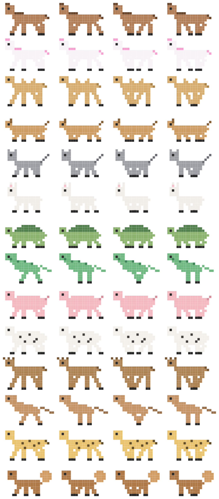

# VibeCheck 🐎

**딸깍 해놓고 딴짓하세요. 동물이 멈추면 끝난 겁니다.**

익숙한 장면이 있습니다. 프롬프트를 넣고, 창을 옮기고, 10초 뒤에 다시 돌아와서
확인합니다. 아직 하는 중. 또 옮겼다가, 또 돌아옵니다. 아직도 하는 중. 결국
"안 봐도 되게 하려고" 시킨 일을 계속 들여다보고 앉아 있습니다.

VibeCheck은 **코딩 어시스턴트가 실제로 일하는 동안에만** 화면에서 달리는 작은 픽셀
동물을 띄웁니다. 이제 힐끗 보기만 하면 됩니다. 달리고 있으면 아직 하는 중,
멈췄으면 가서 확인할 때입니다. 이게 전부입니다.



```bash
git clone https://github.com/b2narae/VibeCheck.git && cd VibeCheck
./scripts/make-app.sh && cp -R build/VibeCheck.app /Applications/ && open /Applications/VibeCheck.app
```

끝입니다. 설정 파일도, API 키도, 로그인도 없습니다. 알아서 세션을 찾아냅니다.
**Claude Code**, **Gemini CLI**, **Codex CLI**를 지원합니다.

---

## 실제로 얻는 것

**🐎 터미널 하나당 동물 한 마리.** 세션 세 개를 동시에 돌리고 있나요? 말 한 마리,
거북이 한 마리, 작은 공룡 한 마리가 각각 특정 터미널에 묶여서 달립니다. "내 탭
다섯 개 중에 뭐가 아직 돌고 있지?"를 탭을 일일이 눌러보는 대신 **쳐다보는 것만으로**
알 수 있습니다.

**🧱 벽이 생기면 당신을 기다리는 중입니다.** Claude가 권한 승인을 요청하거나, API
키를 물어보거나, 질문을 던지면 그 동물 앞에 벽돌 벽이 떨어지고 동물이 멈춰 섭니다.
벽을 밀어보지만 나아가지 못합니다. 10분 뒤에야 "아 예/아니오 하나 기다리고
있었구나" 하고 발견하는 일이 없어집니다.

**🖱️ 동물을 클릭하면 무슨 일을 하는지 알려줍니다.** 마우스를 올리고 클릭하면 어느
프로젝트에서 무엇을 시켰는지 보여줍니다. 동물 세 마리가 달리는데 누가 누군지
헷갈릴 때 유용합니다.

**📉 높이 = 남은 Claude 사용량.** Claude 사용량 한도는 5시간 블록으로 갱신됩니다.
블록이 새로 시작되면 러너가 화면 위쪽에서 달리고, 사용할수록 점점 아래로
내려옵니다. 바닥에 붙어서 달리고 있다면 곧 리셋이니 슬슬 마무리할 때입니다.

**🔔 소리는 취향껏.** "작업 완료"와 "입력 요청" 각각에 macOS 시스템 사운드를
고르거나 끌 수 있습니다. 고를 때 바로 들려줍니다.

**💤 방해하지 않습니다.** 동물 위로 클릭이 그대로 통과하니 작업 중인 앱을 가리지
않습니다. Dock 아이콘도 없습니다. 오버레이를 아예 끄고 메뉴바 표시만 쓸 수도
있습니다.

---

## 러너 소개

어시스턴트별로 원하는 동물을 고르거나, 🎲로 두고 터미널마다 랜덤으로 받아보세요.
전부 직접 찍은 픽셀 스프라이트이고, 4프레임 걸음걸이로 **다리가 진짜 움직입니다.**

| | | | |
|---|---|---|---|
| 🐎 말 | 🦄 유니콘 | 🐫 낙타 | 🐕 개 |
| 🐈 고양이 | 🐇 토끼 | 🐢 거북이 | 🦖 공룡 |
| 🐖 돼지 | 🐄 소 | 🦌 사슴 | 🦘 캥거루 |
| 🐆 치타 | 🐿️ 다람쥐 | | |

네, 거북이도 치타와 같은 속도로 달립니다. 세상은 원래 불공평합니다.

---

## 더 정확하게 (클릭 한 번)

설치 직후에도 별도 설정 없이 알아서 동작합니다. 다만 **정확하게** 쓰고 싶다면
메뉴에서 **"Claude Code 훅 연동"**을 켜세요.

그러면 VibeCheck이 추측하는 대신, Claude Code가 턴 시작·종료와 "입력을 기다리는 중"을
직접 알려줍니다. 권한 프롬프트가 뜨는 즉시 벽이 세워집니다.

```bash
/Applications/VibeCheck.app/Contents/MacOS/VibeCheck --install-hooks     # 메뉴로도 가능
/Applications/VibeCheck.app/Contents/MacOS/VibeCheck --uninstall-hooks
```

`~/.claude/settings.json`에 **병합**만 하며 기존 설정이나 다른 훅은 건드리지
않습니다. 수정 전에 백업도 남깁니다. 끄면 VibeCheck이 추가한 항목만 지웁니다.

---

## 궁금할 만한 것들

**컴퓨터 느려지지 않나요?** 네이티브 Swift 바이너리 하나입니다. Electron도,
런타임도, 의존성도 없습니다. 1초에 두 번쯤 프로세스 목록을 확인하고 픽셀 몇 개를
그리는 게 하는 일의 전부입니다.

**제 코드나 대화를 어디로 보내나요?** 보내지 않습니다. 이 앱에는 네트워크 코드가
아예 없습니다. 로컬 세션 파일을 읽는 것으로 끝입니다.

**훅을 켜면 Claude가 느려지나요?** 훅은 실행되는 동안 Claude를 멈춰 세우기 때문에,
VibeCheck은 도구 단위 이벤트를 쓰지 않고 턴 경계 이벤트만 등록하며 훅 자체가 약
10ms 만에 끝납니다.

**Claude Code를 안 쓰는데요.** Gemini CLI, Codex CLI 러너도 동작합니다. 다만
사용량 높이 표시와 벽은 아직 Claude 전용입니다.

**뭔가 이상하게 동작해요.** `./build/VibeCheck --debug`를 실행하면 각 세션을 어떻게
판단하고 있는지 폴링마다 출력합니다.

---

## 어떻게 동작하나요

<details>
<summary>궁금한 분만 (클릭해서 펼치기)</summary>

1.5초마다 프로세스 목록을 스캔해 `claude` / `gemini` / `codex` 프로세스를 PID(세션)
단위로 추적합니다. 데몬·pty 헬퍼 같은 상주 보조 프로세스는 제외하며, 작업
디렉터리는 libproc(`proc_pidinfo`)으로 읽어 폴링마다 별도 프로세스를 띄우지
않습니다.

**훅을 켠 경우**, `SessionStart`·`UserPromptSubmit`·`Notification`·`Stop`·
`SessionEnd`가 각각 `VibeCheck --hook`을 실행해 세션 상태를 `~/.vibecheck/sessions/`에
기록합니다. 알림 중에서도 실제로 사용자를 기다리는 종류만 벽을 세우고, 유휴 알림이나
완료 알림은 무시합니다. Esc로 턴을 중단하면 `Stop` 훅이 발생하지 않으므로, 대화
기록이 3분간 조용한 "작업 중" 보고는 신뢰하지 않습니다.

**훅을 켜지 않은 경우**, 두 신호를 결합합니다.

1. **CPU** — 자식 프로세스까지 합산해서, 긴 빌드나 테스트 실행도 작업으로 잡습니다.
2. **대화 기록의 턴 상태** — 마지막 항목의 `stop_reason`으로 판별합니다.
   `end_turn`(및 `stop_sequence`·`max_tokens`·`refusal`)일 때만 턴이 끝난 것이고,
   `tool_use`면 아직 이어질 내용이 있다는 뜻이라 API 응답을 기다리며 CPU가 조용한
   구간에도 "작업 중"을 유지합니다. 이게 생각보다 중요합니다. 어시스턴트의 텍스트와
   사고 블록은 **작업 도중에도** 기록되기 때문에, 내용만 보고 판단하면 한 턴 안에서
   수십 번 "끝났다"로 오판해 러너가 계속 퇴장했다 재등장합니다.

5시간 윈도우는 [ccusage](https://github.com/ryoppippi/ccusage)와 같은 방식으로
추정합니다 — 이전 블록 종료 후 첫 활동 시각을 정시로 내림해 5시간을 더합니다.
서버 기준 리셋과 수 분 차이가 날 수 있습니다.

</details>

---

## 동물 추가하기

정말로 2분이면 되는 PR입니다. 스프라이트는 코드로 그립니다. 6가지 몸체 템플릿 중
하나를 고르고, 색상과 특징 하나만 정하면 끝입니다. 전부
[`Sources/VibeCheck/Sprites.swift`](Sources/VibeCheck/Sprites.swift) 안에 있습니다.

```swift
"🦔": Species(.small, body: (0.55, 0.42, 0.32), accent: (0.30, 0.24, 0.18), accessory: .spikes),
```

`./build/VibeCheck --dump-sprites out.png`으로 결과를 미리 볼 수 있습니다.
요구사항은 macOS 13+와 Xcode Command Line Tools입니다.

[English README](README.md) · MIT License
